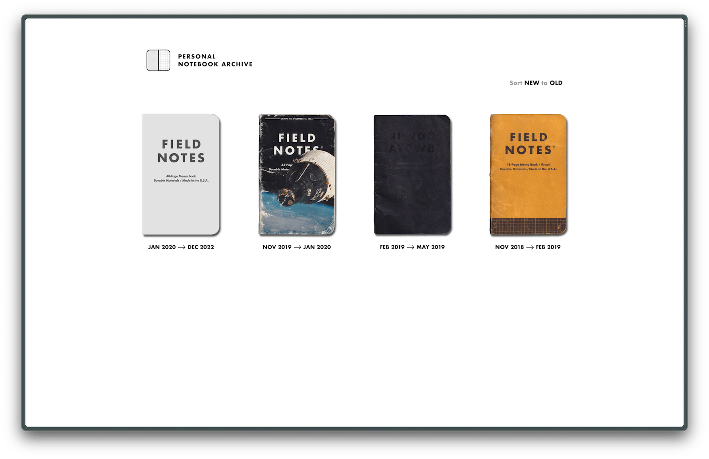

# Personal Notebook Archive

A personal museum of one's past notebooks.

[[Demo](https://goodbyteco.github.io/notebooks)]
[[Running locally](#running-locally)]
[[Customizing the site](#customizing-the-site)]
[[Adding a notebook](#adding-a-notebook)]
[[Deploying the site](#deploying-the-site)]

<br>


<br>

This is a template project for creating a website to view your old notebooks.
You can browse [a demo of the site here](https://goodbyteco.github.io/notebooks),
and hit the <kbd>Use this template</kbd> button above to create your own.


## Running locally

The project uses the [Bun](https://bun.sh/) package manager and runtime. Install
it it by running:

```bash
curl -fsSL https://bun.sh/install | bash

## or, to install using npm:
npm install -g bun
```

You can then use the following commands to build and run a local instance of the
website:

```bash
## install package dependencies
bun install

## run development server
bun run dev
```

You should then be able to view the site at http://localhost:3000/notebooks/, and
recompile automatically as you make changes.


## Customizing the site

Fonts, color schemes, and and other miscellaneous style changes can be made in the
[base.astro](./src/components/base.astro) component (which is applied to every page).
Also note that some styling is done in [meta-social-share-image.astro](./src/components/meta-social-share-image.astro)
to generate the social media URL image previews. 


## Adding a notebook

To add a notebook to the archive, create a new folder in the `notebooks` directory.
Name the folder with the date the notebook was started (in YYYY-MM-DD format), the
location it was started in, the date it was completed, and the location it was completed
in. Use an ascii arrow ("`-->`") to separate the start and complete sections, like so:

```bash
## following this format:
YYYY-MM-DD <location> --> YYYY-MM-DD <location>

## for example:
2020-12-17 Toronto, ON --> 2023-01-19 Victoria, BC
```

Now just add the scans of your notebook into the folder. Name each image the page
number, starting on 0 (`00.png`). Make sure to [zero-pad](https://en.wikipedia.org/wiki/Leading_zero)
the lower pages so they list out in order.

The images should be high quality scans, or photographs taken head-on of each page.
The notebook should be cut-out of the image, leaving a transparent background. Images
should be at least 1600px wide (though too large will cause slow load times).

Once your images are added, you should create [webp](https://en.wikipedia.org/wiki/WebP)
and [avif](https://en.wikipedia.org/wiki/AVIF) versions as well. This can be done
using an [online image converter](https://convertio.co/png-avif/) or command-line
tool, such as [ImageMagick](https://imagemagick.org/).

```bash
## convert all the png files in the current directory to webp and avif using ImageMagick:
convert *.png -set filename:basename "%[basename]"  -write "%[filename:basename].webp" "%[filename:basename].avif"
```

Once you notebook is all set up, run the site locally to make sure everything is in
order. If you do not think the shininess of the notebook cover is inaccurate, you can
configure the glossiness by adding an additional field to the folder's name: append
"` --> x`" to the end of the name, where `x` is some value between `0` and `1`. There will
be no gloss displayed at `0`, and high-gloss displayed at `1`. The default, if unset,
is `0.15`. For example:

```bash
2019-11-11 Kingston, ON --> 2020-01-03 Toronto, ON --> 0.3
```


## Deploying the site

The project includes a [Github Action](https://github.com/features/actions) to deploy
the site using Github Pages (see: [deploy.yml](./.github/workflows/deploy.yml)).
Just activate Github Pages in the repo's **Settings > Pages**, and choose
**Source: Github Actions**. Make sure the base URL configured in the [Astro config file](./astro.config.mjs)
matches the name of the repository.

Alternatively, you can deploy the project to any other platform. See the Astro docs
for [guides on deploying your site](https://docs.astro.build/en/guides/deploy/).


## Historical

For an earlier version of this site, see:
[field-notes-archive.vercel.app](https://field-notes-archive.vercel.app).